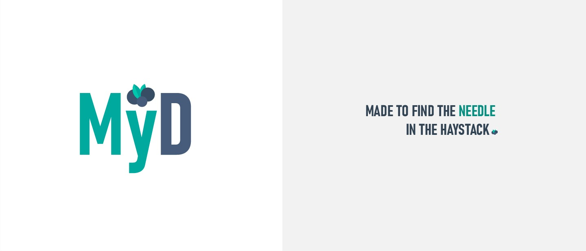

<h2 align="center">
 &#127815; My Drawer  &#127815;
</h2>

<h5 align="center">
  Made to find the needle in the haystack
</h5>

<h5 align="center">
  &#128296; In progress  &#128296;
</h5>

### :page_with_curl: About project

MyD, *My Drawer*, is a **recommendation management system** project divided in 2 versions: one made with *C* language and another with *Java*. For a specified guide for each version, consult the **README** file inside each folder. 

### :art: Authors

  :metal: **a93291**,Marco Delgado Esperanca, *MarcoEsperanca* 

 :vulcan_salute: **a93325**,Henrique Parola Meziara da Costa, *henriqueparola* 

 :call_me_hand: **a93163**, Jose Pedro Dias Nascimento Fernandes, *jpdiasfernandes* 

