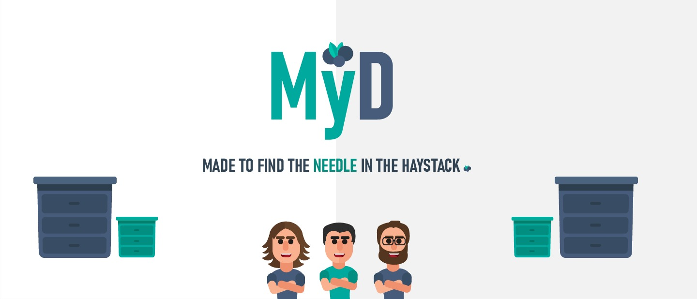

<p align="center">




<h2 align="center">
  &#127815; My Drawer &#127815;
</h2>

<h5 align="center">
  Made to find the needle in the haystack
</h5>

<h5 align="center">
  &#128296; In progress &#128296;
</h5>

:scroll: Summary
=======

* [About project](#about-project)
* [Installation guide](#instalation-guide)
* [Dependencies](#dependencies)
* [User guide](#user-guide) 
  * :boom: [Start program](#start-program)
  * :hatching_chick: [First commands](#first-commands)
  * :hatched_chick: [All commands](#all-commands)
* [Developer guide](#developer-guide)
  * :twisted_rightwards_arrows: [Branches](#branches)
  * :pencil: [Commits](#commits)
  * :open_file_folder: [Folders structure](#folders-structure)
  * :file_folder: [Modules](#modules)
    * [Interpreter](#interpreter)
    * [Table](#table)
* [Authors](#authors)
* [References](#references)
<br>

### About project
 
:grapes: My Drawer is a *recommendation management system*. The project has this name because the program **MyD** do things like the way that you keep your organization in your home with your clothes for example. You probably have a drawer for each type of clothes in order to know how to find fast a specify cloth when you will go out. So, talk in computer language now, MyD basically is program that receive files (big files if you want) with a specify pattern and returns specify information about those files. In simple words, if you have a file with 1000000 names and want to know the names that started by letter 'H', MyD is the perfect solution to solve in a fast way this type of problems! 

### Installation guide

If you want to use the **MyD** program, the first thing that you have to do is *clone* the *MyD* git repository:

    [PROMPT $] git clone https://github.com/dium-li3/grupo24

### Dependencies

*MyD* is a program that has some *libray dependencies* in your source code. So, to compile the program, you already need to have *GLib*. If you want more information: https://developer.gnome.org/glib/

### User guide 

#### :boom: Start program

If you already have seen the **Installation guide**, now the only thing that you have to do, in order to use the program, is the following command (inside root project directory):

    [PROMPT $] make program

This command will *compile* the source code. After that you probably will have a new file, named **prog**. This is the **executable** file of the program, so now you have to do:

    ./prog

#### :hatching_chick: First commands

When you execute the program the first thing that you see is the *MyD logo*, with the actual *version* and the *authors* that create the program. Futhermore, you can see **4 options**:

  * ```?``` Show the **manual**, with all possible commands ; 
  * ```#``` Show a little **text** with the content *"What is MyD ?"*;
  * ```+``` Show the **github link** of the project, for you contribute and interact with the *MyD Team*;
  * ```-``` Exit the program;

```This commands are only the most "simple commands", in the following chapter you can see all commands, like if you insert the "manual" option.```

#### :hatched_chick: All commands

### Developer guide

#### :twisted_rightwards_arrows: Branches 
    
If you are interested to add some features or fix some bugs of our code, you must have following some rules:
* Just edit files that another teammate is not using. At momment we have the following organization:
  
  * **Henrique Costa**: *main.c*, *README.md*, *interpreter*, *Makefile*
  * **José Pedro**: *table*
  * **Marco Esperança**: *data* 

  <br>

* Your **branch name** need to have the following pattern:
  
  ```
  "author_branch-type_branch-name"
  ```
  For example, if Henrique wants to create a *branch* to add content in some base files, like README or Makefile (files that not interfere with project system flow but are essential), he can creates a *branch* like:
  ```
  [PROMPT $] git branch henrique_chore_base-project
  ```
  **Info(1)**: *underscore* "_" separates patterns (henrique_feature) and *hyphen* "-" separates words inside a pattern (base-project).
  <br>

  **Info(2)**: If you have doubt about the *branch_type* rule, I recommend you to use one of the *commit Types* in this article:
https://rodrigobpzantunes2016.medium.com/padr%C3%B5es-para-escrever-mensagens-git-commit-melhores-3d6ff7ba6b
  <br>

  For more information about *branch convention* (section 4): https://codingsight.com/git-branching-naming-convention-best-practices/

<br> 

#### :pencil: Commits

For best pratices, in order to help to track specified information and create a beautiful CHANGELOG, we following the **Convential Commits**: https://www.conventionalcommits.org/en/v1.0.0/ that is inspired by on the **Angular Commit Guidelines**: https://github.com/angular/angular/blob/22b96b9/CONTRIBUTING.md#-commit-message-guidelines 

<br>

Example: If José edit his code, but only changes formatting or code style, without changing its functionality, he can make a commit message like:

```
  git commit -m "style: change file1 code style"
```

**Info(1 - *syntax rule*)**: Your commit message must complete correctly the following phrase: If applied, this commit will <commit_message>
<br>


**Info(2)**: it is a little complex use all of the *semantic rules*, so you can use only: 
```<type>[optional scope]: <description>``` in this project.
<br>

The **Convential Commits** documentation is enough but if you speak portuguese and want information in your language you can see in: https://blog.geekhunter.com.br/o-que-e-commit-e-como-usar-commits-semanticos/ and https://rodrigobpzantunes2016.medium.com/padr%C3%B5es-para-escrever-mensagens-git-commit-melhores-3d6ff7ba6b

<br>


#### :open_file_folder: Folders structure

    TODO

#### :file_folder: Modules 

##### Interpreter

    TODO

##### Table

    TODO

### Authors

:metal: Marco Esperança
<br>
:vulcan_salute: Henrique Costa
<br>
:call_me_hand: José Pedro

### References

 https://codingsight.com/git-branching-naming-convention-best-practices/
 <br>
 https://www.conventionalcommits.org/en/v1.0.0/
 <br>
  https://github.com/angular/angular/blob/22b96b9/CONTRIBUTING.md#-commit-message-guidelines
<br>
 https://blog.geekhunter.com.br/o-que-e-commit-e-como-usar-commits-semanticos/ 
 <br>
https://rodrigobpzantunes2016.medium.com/padrões-para-escrever-mensagens-git-commit-melhores-3d6ff7ba6b

